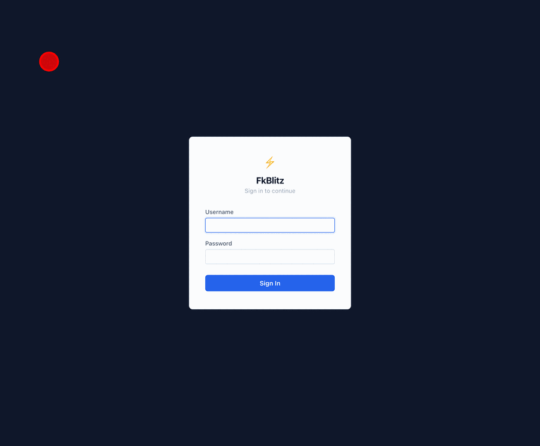

# FkBlitz — Foreign Key Database Browser

### _Blitz through your database by following foreign keys._

[](https://github.com/vivek43nit/fkblitz/actions/workflows/ci.yml)
[](https://github.com/vivek43nit/fkblitz/actions/workflows/ci.yml)
[](https://github.com/vivek43nit/fkblitz/actions/workflows/ci.yml)
[](https://adoptium.net/)
[](https://spring.io/projects/spring-boot)
[](https://react.dev/)
[](https://www.mysql.com/)
[](LICENSE)

**FkBlitz** is a self-hosted, browser-based MySQL/MariaDB client built for navigating relational data fast. Instead of writing JOINs, click a foreign key value and instantly see the referenced row — then keep clicking to traverse your entire data graph.



> **Why FkBlitz?** FK = Foreign Key. Blitz = fast. No JOINs, no context switching, no SQL spelunking.

---

## Who Is This For?

- **Backend engineers** debugging production data and tracing rows across tables
- **Support & data teams** looking up related records without writing SQL
- **DBAs** exploring unfamiliar schemas and discovering undocumented relationships

---

## Features

- **FK navigation** — click to follow a foreign key forward; ↙ to see all rows that reference a value
- **Trace** — one click expands the full FK chain across all related tables
- **Custom relationships** — define soft references and cross-database joins not in the schema
- **Many-to-many support** — navigate through junction tables automatically
- **Multi-environment** — group connections by env (prod, staging, local) and switch in one click
- **Inline CRUD** — Add, Edit, Delete rows directly from the result grid
- **Column filters & sorting** — per-column filter inputs and clickable sort headers
- **Converter utility** — IP ↔ integer, date ↔ epoch ms, live server clock
- **RBAC auth** — ADMIN / READ_WRITE / READ_ONLY roles with multiple user-store backends
- **OAuth2/OIDC** — sign in with Google, GitHub, or any OIDC provider (optional)
- **Observability** — Prometheus metrics, structured JSON logging with W3C distributed tracing (`trace_id` / `span_id`), Grafana dashboard
- **Kubernetes-ready** — Helm chart with HPA, health probes, and optional Redis

---

## Quick Start

### Docker Compose

```sh
git clone https://github.com/vivek43nit/fkblitz.git
cd fkblitz
docker compose up --build
```

Open **[http://localhost:9044/fkblitz/](http://localhost:9044/fkblitz/)** — default login: `admin` / `changeme`.

The stack starts FkBlitz, a sample MariaDB, Redis, Prometheus, and Grafana together.

### Point it at your own database

Edit `backend/src/main/resources/DatabaseConnection.xml`:

```xml
<CONNECTIONS CONNECTION_EXPIRY_TIME="3600000" MAX_RETRY_COUNT="10">
    <CONNECTION
        ID="1"
        GROUP="myenv"
        DB_NAME="mydb"
        DRIVER_CLASS_NAME="com.mysql.cj.jdbc.Driver"
        DATABASE_URL="jdbc:mysql://localhost:3306/mydb?useInformationSchema=true"
        USER_NAME="root"
        PASSWORD="secret"
        UPDATABLE="true"
        DELETABLE="true"
    />
</CONNECTIONS>
```

Then `docker compose up --build` again.

### Local dev (without Docker)

**Requirements:** Java 17+, Maven 3.6+, Node.js 20+, a running MySQL or MariaDB.

```sh
# Backend
cd backend && mvn spring-boot:run

# Frontend (separate terminal)
cd frontend && npm install && npm run dev
```

Frontend dev server: [http://localhost:5173/](http://localhost:5173/)  
Production build served by Spring Boot: [http://localhost:9044/fkblitz/](http://localhost:9044/fkblitz/)

---

## Project Structure

```
fkblitz/
├── backend/          # Spring Boot 3 REST API (Java 17)
├── frontend/         # React 18 SPA (Vite + TanStack Table)
├── helm/fkblitz/     # Kubernetes Helm chart
├── docker/           # Prometheus config + Grafana dashboards
├── docker-compose.yml
└── Dockerfile        # Multi-arch (linux/amd64, linux/arm64)
```

---

## Enterprise Testing

FkBlitz ships a full test pyramid — from fast unit tests up to multi-node cluster validation and browser E2E flows.

```
        /\
       /E2E\         3 flows — auth, browse, query  (Playwright/Chromium)
      /------\
     / Cluster \     Redis pub/sub multi-node propagation  (Docker Compose)
    /------------\
   /  Integration \  Real MariaDB via Testcontainers
  /----------------\
 /    Unit (233+)   \ controllers, services, config loaders  (JUnit 5 + Mockito)
/--------------------\
```

| Layer | Count | Tech | CI gate |
|---|---|---|---|
| Unit + MockMvc | 233+ | JUnit 5, Mockito, AssertJ | All PRs — 80% JaCoCo enforced |
| Security regression | 12 cases | MockMvc | All PRs |
| Real-DB integration | 30+ | Testcontainers MariaDB 11 | `mvn verify -Pintegration-tests` |
| Cluster (multi-node) | 1 scenario | Docker Compose + bash | Push to `master` |
| Performance | 3 scripts | k6 (via Docker) | PRs to `master` |
| E2E (browser) | 3 flows | Playwright (Chromium) | PRs to `master` |

### Performance Baselines

> Measured on Apple M-series (local Docker stack). Captured: 2026-04-08.

| Script | VUs | p50 | p95 | p99 | Errors |
|---|---|---|---|---|---|
| `k6-metadata.js` — `GET /api/tables` | 50 | 1.75ms | **2.72ms** | 4.08ms | 0.00% |
| `k6-auth.js` — `POST /api/login` | 10→100 | 646ms | 5.09s | — | 0.00% (zero 5xx) |
| `k6-reload-concurrent.js` — concurrent reads | 50 | 2.24ms | **5.48ms** | — | 0.00% |

### Capacity Benchmark

`k6-capacity.js` runs a VU ladder (10 → 25 → 50 → 100 → 150 → 200) and captures JVM heap, JDBC pool, and Tomcat thread usage via `capacity-poll.sh`. Use the results to size your production deployment.

> Measured at 200 VUs on Apple M-series, `FKBLITZ_MAX_POOL_SIZE=100`, `FKBLITZ_TOMCAT_THREADS_MAX=400`, `-Xmx1g`.

| Resource | Peak (200 VUs) | Recommended config |
|---|---|---|
| JDBC connections active | < 1 (sub-ms borrows) | `FKBLITZ_MAX_POOL_SIZE=10` |
| Tomcat threads busy | 15 | `FKBLITZ_TOMCAT_THREADS_MAX=50` |
| JVM heap | 198 MB | `-Xmx256m` |
| `latency_groups` p95 | 41ms | — |

```sh
bash tests/performance/capacity-poll.sh > /tmp/capacity-metrics.csv &
docker run --rm --network host \
  -v "$(pwd)/tests/performance:/tests" \
  grafana/k6 run /tests/k6-capacity.js 2>&1 | tee /tmp/capacity-k6.txt
kill %1
bash tests/performance/capacity-report.sh /tmp/capacity-metrics.csv /tmp/capacity-k6.txt
```

### How to Run Each Layer

```sh
# Fast unit + security regression (no Docker needed)
cd backend && mvn test

# Frontend unit + accessibility (axe-core)
cd frontend && npm test

# Real-DB integration tests (requires Docker for Testcontainers)
cd backend && mvn verify -Pintegration-tests

# Multi-node cluster test (requires Docker Compose + jq + mysql-client)
bash tests/cluster/cluster_test.sh

# Performance load tests (requires full stack running)
docker compose up -d
docker run --rm --network host \
  -v "$(pwd)/tests/performance:/tests" \
  -e BASE_URL=http://localhost:9044/fkblitz \
  -e USERNAME=admin -e PASSWORD=changeme \
  -e GROUP=demo -e DATABASE=demo \
  grafana/k6 run /tests/k6-metadata.js

# Browser E2E tests (requires full stack running)
docker compose up -d
cd tests/e2e && npm install && npx playwright install chromium
npx playwright test
```

---

## Production Deployment

For team deployments, authentication setup, Kubernetes, Redis, Prometheus, and all other production concerns — see the **[Enterprise Configuration Guide](docs/ENTERPRISE.md)**.

---

## Contributing

1. Fork and create a branch: `feat/my-feature`, `fix/my-bug`
2. Commit using [conventional commits](https://www.conventionalcommits.org/): `feat:`, `fix:`, `docs:`, etc.
3. Open a focused PR — one concern per PR

---

## License

MIT License. See [LICENSE](LICENSE) for details.
